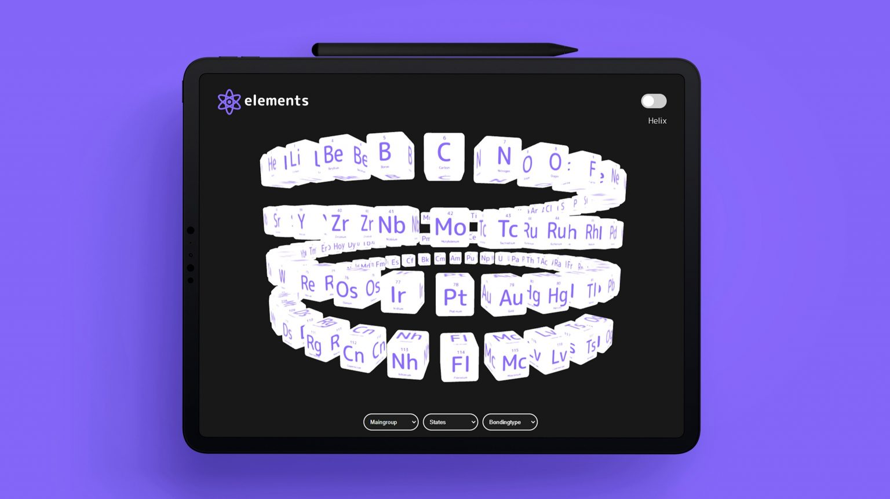

# elements


Elements is web application utilizing React Three Fiber to showcase the periodic table in a 3D environment.

## Table of Content

1. [Introduction](#introduction)
2. [Installation](#installation)
3. [Features](#features)
4. [License](#license)

## Introduction

The application originated from a group project for a university course on "Information Spaces." I further developed the resulting prototype, implementing it in a declarative manner using React Three Fiber.

Authors: @lisaberger @teresahause @marvinmurmann

## Installation

Start the app

```bash
npm install
npm run dev
```

## Features

1. [Particle System](#particle-system)
2. [3D-Helix View of Elements](#3d-helix-view-of-elements)
3. [Different Filtering Options](#different-filtering-options)
4. [Physics](#physics) (coming soon)
5. [Shader Materials](#shader-materials) (coming soon)

### Particle System

On the starting page, a simple particle system is displayed in the background.

### 3D-Helix View of Elements

...

### Different Filtering Options

...

### Physics

Physics feature is coming soon.

### Shader Materials

Shader materials feature is coming soon.

<hr />

&copy; elements
